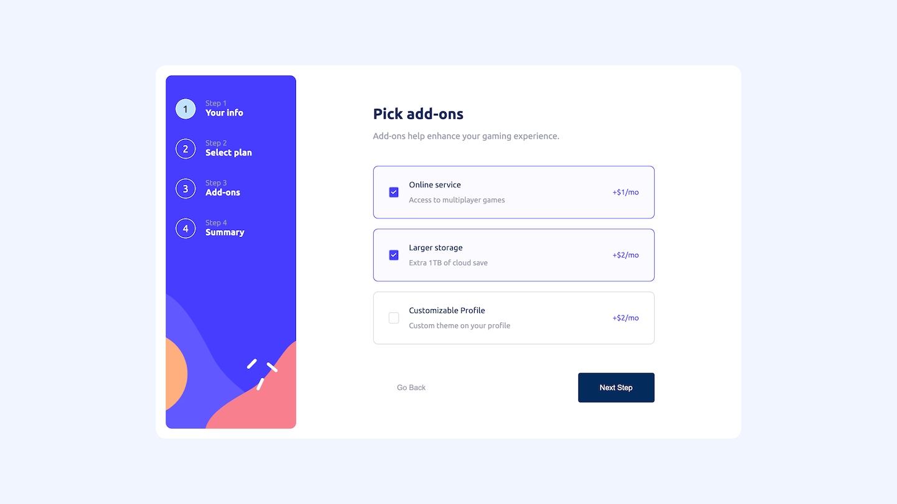

# Frontend Mentor - Multi-step form solution

This is a solution to the [Multi-step form challenge on Frontend Mentor](https://www.frontendmentor.io/challenges/multistep-form-YVAnSdqQBJ). Frontend Mentor challenges help you improve your coding skills by building realistic projects. 

## Table of contents

- [Frontend Mentor - Multi-step form solution](#frontend-mentor---multi-step-form-solution)
  - [Table of contents](#table-of-contents)
  - [Overview](#overview)
    - [The challenge](#the-challenge)
    - [Screenshot](#screenshot)
    - [Links](#links)
  - [My process](#my-process)
    - [Built with](#built-with)
    - [What I learned](#what-i-learned)
    - [Continued development](#continued-development)
    - [Useful resources](#useful-resources)
  - [Author](#author)

## Overview

### The challenge

Users should be able to:

- Complete each step of the sequence
- Go back to a previous step to update their selections
- See a summary of their selections on the final step and confirm their order
- View the optimal layout for the interface depending on their device's screen size
- See hover and focus states for all interactive elements on the page
- Receive form validation messages if:
  - A field has been missed
  - The email address is not formatted correctly
  - A step is submitted, but no selection has been made

### Screenshot





### Links

- Solution URL: [Multi-step form solution](https://github.com/iberis9611/Multi-step-form)
- Live Site URL: [Multi-step form live site](https://iberis9611.github.io/Multi-step-form/)

## My process

### Built with

- Semantic HTML5 markup
- CSS custom properties
- Flexbox
- CSS Grid
- Mobile-first workflow
- [SASS](https://sass-lang.com/) - For styles
- [BEM](https://getbem.com/) - For reusable components

### What I learned

1. HTML data-* attributes
```html
 <form class="main__form" data-multi-step>
  <fieldset class="card active" data-step></fieldset>
  <fieldset class="card" data-step></fieldset>
</form>
```
```css
button[data-confirm] {
    background-color: hsl(243, 100%, 62%);
}

button[data-previous] {
    background-color: transparent;
    color: hsl(231, 11%, 63%);
    
}

button[data-next] {
    background-color: hsl(213, 96%, 18%);
    grid-column: 2 / 3;
}
```
```js
const multiStepForm = document.querySelector("[data-multi-step]");
const formSteps = [...multiStepForm.querySelectorAll("[data-step]")];
```

2. Center an absolute positioned element horizontally
```scss
.card {
  height: calc(100vh - u.rem(171));
  position: relative;

  &__main {
    width: calc(100% - u.rem(15));
    position: absolute;
    top: u.rem(-70);
    left: 0;
    right: 0;
    margin-inline: auto;
  }
}
```

3. ::placeholder CSS pseudo-element
```scss
&__input::placeholder {
  color: hsl(231, 11%, 63%);
}
```

4. How to change the background color of checkbox input
```css
input[type=checkbox] {
    accent-color: hsl(243, 100%, 62%);
    width: u.rem(20);
    height: u.rem(20);
}
```

5. Document.querySelectorAll(): returns a nodeList, we need to convert it to array in order to iterate over it.
```js
const formSteps = [...multiStepForm.querySelectorAll("[data-step]")];
```

6. Array.prototype.findIndex(): The findIndex() method returns the index of the first element in an array that satisfies the provided testing function. If no elements satisfy the testing function, -1 is returned.
```js
let currentStep = formSteps.findIndex((step, index) => {
    return step.classList.contains("active");
})
```

7. Array.prototype.every(): The every() method tests whether all elements in the array pass the test implemented by the provided function. It returns a Boolean value.
```js
const inputs = [...formSteps[currentStep].querySelectorAll("input")];
```

8. HTMLInputElement.checkValidity(): returns a boolean value which indicates validity of the value of the element. If the value is invalid, this method also fires the invalid event on the element.
```js
const allValid = inputs.every(input => input.checkValidity());
if (allValid) {
    currentStep += 1;
    showCurrentStep();
}
```

9. overflow:hidden - hide absolute items that are positioned out of viewport.
```scss
&__form {
    height: inherit;
    position: relative;
    overflow: hidden;
}
```

10. Use regular expression in html with the pattern attribute of input.
```html
<input 
  class="content__input" 
  type="email" 
  name="email" 
  id="email" 
  placeholder="e.g. stephenking@lorem.com" 
  required
  pattern="^\w+@\w+.(com|cn)$"
>
```

11. checked - check if a checkbox is checked.
```js
const addons = [...document.querySelectorAll(".addon")];
addons.forEach(addon => {
    addon.addEventListener("click", e => {
        addon.classList.toggle("picked", addon.getElementsByTagName("input")[0].checked)
    })
})
```

12. String.prototype.match(): Retrieves the result of matching a string against a regular expression. Returns a string Array whose contents depend on the presence or absence of the global (g) flag, or null if no matches are found.
```js
// Calculate the total price upon clicking on the last 'next step' button
if (index === 2) {
    let total;
    const regex= /(\d+)/;

    total = parseInt(selectedPlanPrice.textContent.match(regex)[0]);
    summaryAddonsPrice.forEach(price => {
        if (!price.parentElement.classList.contains("offscreen")) {
            total += parseInt(price.textContent.match(regex)[0]);
        }
    })

    if (currentSubscription === 0) {
        priceTotal.textContent = `$${total}/mo`;
    } else {
        priceTotal.textContent = `$${total}/yr`;
    }
}
```

13. How to change the color of hr
```css
hr {
    border: none;
    height: 0.5rem;
    background-color: hsl(229, 24%, 87%);
}
```

14. CSS comparison function clamp(): Calculates the central of a minimum, central, and maximum values.
```scss
&__body {
  width: clamp(u.rem(292), calc(100% - u.rem(24)), u.rem(450));
}
```

15. CSS justify-self property: sets the way a box is justified inside its alignment container along the appropriate axis.
- In grid/block-level/absolutely-positioned elements layouts, it aligns an item inside its grid area/containing block on the inline axis. 
- In flexbox and table cell layouts, this property is ignored.
```scss
button[data-next] {
  background-color: hsl(213, 96%, 18%);
  grid-column: 2 / 3;
  justify-self: end;
}
```

- Note: 
Element.querySelector() returns an element.
Element.querySelectorAll() returns a static (not live) NodeList.
Element.getElementsByTagName() returns a live HTMLCollection.

### Continued development

- Update checkbox style
- Update input fill-in background

### Useful resources

- [Can I Create This Complex Animated Multistep Form?](https://www.youtube.com/watch?v=VdqtdKXxKhM&list=LL&index=15) - This is an amazing video which helped me finally understand how to build a multi-step form on a single page. I'd recommend it to anyone still learning this concept.

## Author

- Website - [Oliver C.](https://github.com/iberis9611)
- Frontend Mentor - [@iberis9611](https://www.frontendmentor.io/profile/iberis9611)